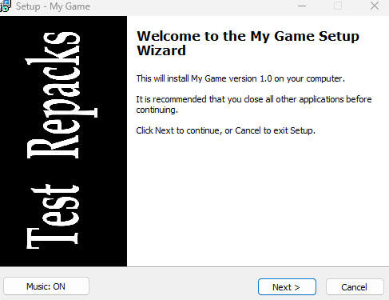

# UnpackKit

An [Inno Setup](https://jrsoftware.org/isinfo.php) 5.5.0 (Unicode) script that
builds an installer which extracts **FreeArc (`.arc`) archives compressed with
lolz**, with optional background music, shortcuts and an
uninstaller that cleans everything up.

The data is on an external `.arc` file next to the installer.

## How it works

1. Compress your files with `compress.bat` into `Output\fg-01.arc`.
2. Compile `setup.iss` on **Inno Setup Compiler**, which produces `Output\setup.exe`.
3. Distribute `setup.exe` and `fg-01.arc` together.
4. When the user runs the installer, it:
   - shows the usual wizard pages (components, tasks) plus a page to choose
     the folder that contains the `.arc` file (default: the folder of `setup.exe`).
   - copies the bundled extraction tools to a temporary folder.
   - runs `arc.exe x ...` (the same command as `decompress.bat`) and shows the
     real progress by reading the extractor's output.
   - _(Optional)_ creates the shortcuts and launches the program.
5. The uninstaller deletes the whole install folder.

## Requirements

- [Inno Setup 5.5.0 Unicode edition](https://files.jrsoftware.org/is/5/) (Help > About shows `(u)`).
- A FreeArc build **with lolz support**, for compressing, and one for
  extracting. See [`tools/README.md`](tools/README.md). Not included here.

## Quick start

1. Install the tools described in [`tools/README.md`](tools/README.md).
2. Copy the files you want to pack into `Game/` folder.
3. Run `compress.bat`. It creates `Output\fg-01.arc`.
4. Edit the `#define` block at the top of `setup.iss` (see below).
5. _(Optional)_ add your images and music to `images/`.
6. Open `setup.iss` in Inno Setup Compiler and press **F9**.
7. Distribute `Output\setup.exe` together with `Output\fg-01.arc` to whomever you want.

## Configuration

Everything you normally change is at the top of `setup.iss`:

| Define            | Meaning                                                                 |
|-------------------|-------------------------------------------------------------------------|
| `MyAppName`       | Name shown in the installer and used for the install folder             |
| `MyAppVersion`    | Version string                                                          |
| `MyAppPublisher`  | Publisher string                                                        |
| `MyAppExe`        | Executable name, relative to the install folder                         |
| `ArcPassword`     | Archive password; leave `""` if not encrypted                           |
| `GameSizeMB`      | Size of the game **already extracted**, in MB (used for the disk check) |
| `ArcCount`        | Number of active `.arc` files (see below)                               |

Change the `AppId` GUID in `[Setup]` for every project (Tools > Generate
GUID in the IDE). Two installers sharing a GUID are treated as the same app.

## Multiple `.arc` files

The script ships with one file (`fg-01.arc`) and has the others commented out.
To add more, do three things:

1. In `[Components]`, uncomment the components you need.
2. In `ArcFileFor` and `ArcIsSelected` (in `[Code]`), uncomment the `case`
   branches with the same number.
3. Raise `#define ArcCount` to the number of active files.

## Optional assets

Put it on `images/` (see [`images/README.md`](images/README.md)). Missing
files are skipped automatically:

- `WizardImage0.bmp`, `WizardSmallImage0.bmp`: wizard images.
- `music.mp3`: background music, with an ON/OFF button in the wizard.

To see error messages about the music, uncomment `;#define DebugMusic`.

## Uninstaller

`[UninstallDelete]` removes the whole install folder.
The install folder page is disabled (`DisableDirPage=yes`): the folder is always
`DefaultDirName`, so nobody can install into a shared folder like `C:\Games`
and then lose it on uninstall. Saves stored inside the install folder are
deleted too.

## License and disclaimer

The scripts in this repository are released under the [MIT License](LICENSE).

FreeArc, lolz and Inno Setup are third-party tools with their own licenses;
none of them is included here. Use this project only to package files that you
own or have the right to distribute.
